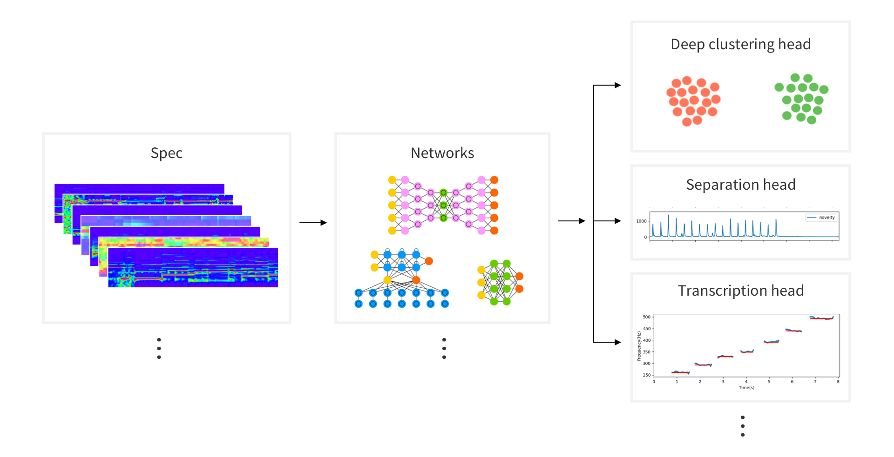

 

# audioFlux

<!--<p align="center">
 
</p>-->


<!-- 
[](https://pypi.org/project/aubio/)
[](https://anaconda.org/conda-forge/aubio)
[](http://aubio.readthedocs.io/en/latest/?badge=latest "Latest documentation") -->
<!---->

<!-- shields.io -->


[](https://pypi.org/project/audioflux/)
[](https://pypi.org/project/audioflux/)
[](https://audioflux.top/index.html)

<!--[](https://pypi.org/project/audioflux/)-->

[](https://doi.org/10.5281/zenodo.7548288)

<!--[](https://codebeat.co/projects/github-com-libaudioflux-audioflux-master)
-->


**`audioflux`** is a deep learning tool library for audio and music analysis, feature extraction. It supports dozens of
time-frequency analysis transformation methods and hundreds of corresponding time-domain and frequency-domain feature
combinations. It can be provided to deep learning networks for training, and is used to study various tasks in the audio
field such as Classification, Separation, Music Information Retrieval(MIR) and ASR etc.

<!-- **`audioflux`** has the following features: 
- Systematic and multi-dimensional feature extraction and combination can be flexibly used for various task research and analysis.
- High performance, core part C implementation, FFT hardware acceleration based on different platforms, convenient for large-scale data feature extraction.
- It supports the mobile end and meets the real-time calculation of audio stream at the mobile end. -->

### Table of Contents

- [Overview](#overview)
- [Installation](#installation)
    - [Python Package Install](#python-package-install)
    - [Other Build](#other-build)
- [Quickstart](#quickstart)
- [Benchmark](#benchmark)
    - [Server Performance](#server-performance)
    - [Mobile Performance](#mobile-performance)
- [Documentation](#documentation)
- [Contributing](#contributing)
- [Citing](#citing)
- [License](#license)

## Overview

**`audioFlux`** is based on data stream design. It decouples each algorithm module in structure, and can quickly and efficiently extract features of multiple dimensions. The following is the main feature architecture diagram.


<!---->

You can use multiple dimensional feature combinations, select different deep learning networks training,  study various tasks in the audio field such as Classification, Separation, MIR etc.




The main functions of **`audioFlux`** include **transform**, **feature** and **mir** modules.

#### 1. Transform

In the time–frequency representation, main transform algorithm:

- **`BFT`**&nbsp;&nbsp; - &nbsp;&nbsp;Based Fourier Transform, similar short-time Fourier transform.
- **`NSGT`** - &nbsp; Non-Stationary Gabor Transform.
- **`CWT`**&nbsp;&nbsp; - &nbsp;&nbsp;Continuous Wavelet Transform.
- **`PWT`**&nbsp;&nbsp; - &nbsp;&nbsp;Pseudo Wavelet Transform.

<!-- &emsp -->

The above transform supports all the following frequency scale types:

- Linear - Short-time Fourier transform spectrogram.
- Linspace - Linspace-scale spectrogram.
- Mel - Mel-scale spectrogram.
- Bark - Bark-scale spectrogram.
- Erb - Erb-scale spectrogram.
- Octave - Octave-scale spectrogram.
- Log - Logarithmic-scale spectrogram.

The following transform are not supports multiple frequency scale types, only used as independent transform:

- **`CQT`** - &nbsp;&nbsp;Constant-Q Transform.
- **`VQT`** - &nbsp;&nbsp;Variable-Q Transform.
- **`ST`**&nbsp;&nbsp; - &nbsp;&nbsp;S-Transform/Stockwell Transform.
- **`FST`** - &nbsp;&nbsp;Fast S-Transform.
- **`DWT`** - &nbsp;&nbsp;Discrete Wavelet Transform.
- **`WPT`** - &nbsp;&nbsp;Wave Packet Transform.
- **`SWT`** - &nbsp;&nbsp;Stationary Wavelet Transform.

Detailed transform function, description, and use view the documentation.

The *_synchrosqueezing_* or *_reassignment_* is a technique for sharpening a time-frequency representation, contains the
following algorithms:

- **`reassign`** - reassign transform for `STFT`.
- **`synsq`** - reassign data use `CWT` data.
- **`wsst`** - reassign transform for `CWT`.

#### 2. Feature

The feature module contains the following algorithms:

- **`spectral`** - Spectrum feature, supports all spectrum types.
- **`xxcc`** - Cepstrum coefficients, supports all spectrum types.
- **`deconv`** - Deconvolution for spectrum, supports all spectrum types.
- **`chroma`** - Chroma feature, only supports `CQT` spectrum, Linear/Octave spectrum based on `BFT`.

<!-- harmonic pitch class profiles(HPCP) -->

#### 3. MIR

The mir module contains the following algorithms:

- **`pitch`** - YIN, STFT, etc algorithm.
- **`onset`** - Spectrum flux, novelty, etc algorithm.
- **`hpss`** - Median filtering, NMF algorithm.


## Installation


The library is cross-platform and currently supports Linux, macOS, Windows, iOS and Android systems.

### Python Package Install

To install the **audioFlux** package, Python >=3.6, using the released python package.

Using PyPI:

```
$ pip install audioflux 
```

Using Anaconda:

```
$ conda install -c tanky25 -c conda-forge audioflux
```

<!--Read installation instructions:
https://audioflux.top/install-->

### Other Build

- [iOS build](docs/installing.md#ios-build)
- [Android build](docs/installing.md#android-build)
- [Building from source](docs/installing.md#building-from-source)

## Quickstart

- [Mel & MFCC](docs/examples.md#mel--mfcc)
- [CWT & Synchrosqueezing](docs/examples.md#cwt--synchrosqueezing)
- [CQT & Chroma](docs/examples.md#cqt--chroma)
- [Different Wavelet Type](docs/examples.md#different-wavelet-type)
- [Spectral Features](docs/examples.md#spectral-features)
- [Pitch Estimate](docs/examples.md#pitch-estimate)
- [Onset Detection](docs/examples.md#onset-detection)
- [Harmonic Percussive Source Separation](docs/examples.md#harmonic-percussive-source-separation)

More example scripts are provided in the [Documentation](https://audioflux.top/) section.

## Benchmark

### Server Performance

server hardware:

    - CPU: AMD Ryzen Threadripper 3970X 32-Core Processor
    - Memory: 128GB

Each sample data is 128ms(sampling rate: 32000, data length: 4096).

The total time spent on extracting features for 1000 sample data.

| Package    | [audioFlux](https://github.com/libAudioFlux/audioFlux) | [librosa](https://github.com/librosa/librosa) | [pyAudioAnalysis](https://github.com/tyiannak/pyAudioAnalysis) | [python\_speech\_features](https://github.com/jameslyons/python_speech_features) |
| ------ |  ------ |  ------ |  ------ |  ------ | 
| Mel    | 0.777s    | 2.967s  | --              | --                       |
| MFCC   | 0.797s    | 2.963s  | 0.805s          | 2.150s                   |
| CQT    | 5.743s    | 21.477s | --              | --                       |
| Chroma | 0.155s    | 2.174s  | 1.287s          | --                       |

### Mobile Performance

For 128ms audio data per frame(sampling rate: 32000, data length: 4096).

The time spent on extracting features for 1 frame data.

| Mobile | iPhone 13 Pro | iPhone X | Honor V40 | OPPO Reno4 SE 5G |
| ------ |  ------ |  ------ |  ------ |  ------ | 
| Mel    | 0.249ms       | 0.359ms  | 0.313ms   | 0.891ms          |
| MFCC   | 0.249ms       | 0.361ms  | 0.315ms   | 1.116ms          |
| CQT    | 0.350ms       | 0.609ms  | 0.786ms   | 1.779ms          |
| Chroma | 0.354ms       | 0.615ms  | 0.803ms   | 1.775ms          |

## Documentation

Documentation of the package can be found online:

[https://audioflux.top](https://audioflux.top/)

## Contributing

We are more than happy to collaborate and receive your contributions to **`audioFlux`**. If you want to contribute,
please fork the latest git repository and create a feature branch. Submitted requests should pass all continuous
integration tests.

You are also more than welcome to suggest any improvements, including proposals for need help, find a bug, have a
feature request, ask a general question, new algorithms. <a href="https://github.com/libAudioFlux/audioFlux/issues/new">
Open an issue</a>

## Citing

If you want to cite **`audioFlux`** in a scholarly work, please use the following ways:

- If you are using the library for your work, for the sake of reproducibility, please cite the version you used as
  indexed at Zenodo:

  [](https://doi.org/10.5281/zenodo.7548288)

## License

audioFlux project is available MIT License.


