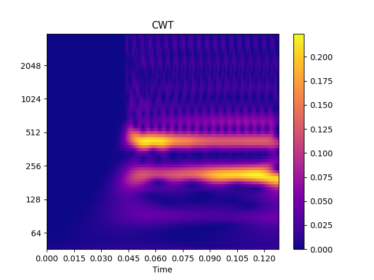
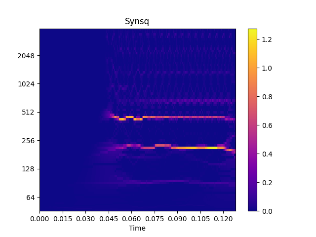

 


<!-- shields.io -->


[](https://pypi.org/project/audioflux/)
[](https://pypi.org/project/audioflux/)
[](https://audioflux.top/index.html)

<!--[](https://pypi.org/project/audioflux/)-->

[](https://doi.org/10.5281/zenodo.7548288)

### Continuous Wavelet Transform


#### $$X_\omega(a,b)=\int_{-\infty}^\infty x(t)\psi_{a,b}(t) \mathrm{d}t $$

Where, $\psi_{a,b}(t)=\frac{1}{\sqrt{a}}\psi(\frac{t-b}{a})$, $a$ determines the frequency domain scaling scale, $b$ time translation scale, and when $a=1,2,4,\cdots $ is expressed as discrete wavelet transform($dwt$).

There are two ways to implement the $cwt $ algorithm:   

1. Perform the '$* $' convolution operation of time-domain data and time-domain wavelet function according to the formula.   
2. Calculate $filterBank $ and perform  $dot $ operations based on the frequency domain wavelet function. Under the same effect, the performance of mode 2 is much better than that of mode 1

Based on the implementation method of 2, $k $ $scale $ scales are $k $ times of $FFT $ operations. The complexity is about $ {O} (kN log N) $ , but the frequency domain form of the $ \psi(t) $  function is required, while some $ \psi(t) $ function frequency domain forms may not have effective derivation formulas. In actual business, some $ \Psi(\omega) $ commonly used in the industry can meet the analysis effects of other $ \psi(t) $ scales. Based on this, the $cwt $ module in this project is implemented based on the method of 2, No longer consider the implementation based on 1.

Support Morlet Wavelet, Morse Wavelet, Bump Wavelet, and Pual Wavelet etc.  

$$ \Psi(\omega)=\pi^{-1/4}e^{-(\omega-\omega_0)^2/\sigma} $$
$$\Psi_{\beta, \gamma}(\omega) = U(\omega)a_{\beta,\gamma}  \omega^{\beta}e^{-\omega^{\gamma}} $$
$$ \Psi(\omega)=e^{(1-\frac{1}{1-(\omega-\omega_0)^2/\sigma^2}) }I(\omega) $$
$$\Psi(\omega)=U(\omega)\frac{2^m}{\sqrt{m(2m-1)!}}\omega^{m}e^{-\omega}$$

The use of CWT is as follows:

```python
import audioflux as af
# Create CWT Obj
cwt_obj = af.CWT(num=84, wavelet_type =WaveletContinueType.MORSE)
# Cal cwt for audio data
spec_arr = cwt_obj.cwt(audio_arr)
```

### Synchrosqueezing

> $W(f,t)$ is cwt time-frequency function   

#### $$ \hat{\omega}(f,t)=\frac1{2\pi} \partial_t \mathrm{arg}W(f,t) $$

Rearrangement of cwt results, API usage is as follows:

```python 
# Create Synchrosqueezing Obj
synsq_obj = synsq_obj = af.Synsq(num=cwt_obj.num)
# Synchrosqueezing cwt spectrogram
synsq_arr = synsq_obj.synsq(cwt_spec_arr)
```

### Reassign 
> $h(t)$ is window function  
>
> $X(t,\omega)=\int_{-\infty}^\infty x(\tau)h(\tau-t)e^{-j\omega \tau}\mathrm{d}\tau $
> 
> $ h_\tau(t)=t\cdot h(t) \quad h_{\mathcal{D} }=\frac{\mathrm{d}}{\mathrm{d}t} h(t) $ 
> 
> $ X_{\tau}(t,\omega)=\int_{-\infty}^\infty x(\tau)h_\tau(\tau-t)e^{-j\omega \tau}\mathrm{d}\tau \quad X_\mathcal{D}(t,\omega)=\int_{-\infty}^\infty x(\tau)h_{\mathcal{D}}(\tau-t)e^{-j\omega \tau}\mathrm{d}\tau $

#### $$ \hat{\omega}(t,\omega)=\omega- \Im \left\{ \frac{X_\mathcal{D}(t,\omega) } { X(t,\omega)  } \right\} $$

#### $$ \hat{t}(t,\omega)=t+\Re \left\{ \frac{X_\tau(t,\omega) } { X(t,\omega) }  \right\} $$

$\hat{t}$ and $ \hat{\omega}$ calculate the corresponding mapping index $\alpha_I$ and $\beta_ I$, joint filtering generates $\gamma_ I$ , set 

$(i,j)=(\alpha_i(\gamma_i), \beta_ i(\gamma_i) )$

Use $\overrightarrow {\| X(t,\omega) \|} $ as the data source and $(i, j) $ as the index accumulation to finally get the rearrangement result $\hat{X} (t, omega)$.

$reassign$ is supports STFT and CWT, rearrange API(wsst) for cwt in the same way:

```python
# Create WSST Obj
wsst_obj = af.WSST(num=84, wavelet_type =WaveletContinueType.MORSE)
# Reassign cwt spectrogram
spec_arr = wsst_obj.wsst(audio_arr)
```

### Demo 

```python
import numpy as np

import audioflux as af
from audioflux.type import SpectralFilterBankScaleType, WaveletContinueType
from audioflux.utils import note_to_hz

import matplotlib.pyplot as plt
from audioflux.display import fill_spec

# Get a 220Hz's audio file path
sample_path = af.utils.sample_path('220')

# Read audio data and sample rate
audio_arr, sr = af.read(sample_path)
audio_arr = audio_arr[:4096]

# Create CWT Obj
cwt_obj = af.CWT(num=84, radix2_exp=12, samplate=sr, low_fre=note_to_hz('C1'),
                 bin_per_octave=12, wavelet_type=WaveletContinueType.MORSE,
                 scale_type=SpectralFilterBankScaleType.OCTAVE)

# Extract spectrogram
cwt_spec_arr = cwt_obj.cwt(audio_arr)

# Create Synchrosqueezing obj
synsq_obj = af.Synsq(num=cwt_obj.num,
                     radix2_exp=cwt_obj.radix2_exp,
                     samplate=cwt_obj.samplate)

# Reassign CWT spectrogram
synsq_arr = synsq_obj.synsq(cwt_spec_arr,
                            filter_bank_type=cwt_obj.scale_type,
                            fre_arr=cwt_obj.get_fre_band_arr())

# Show CWT
fig, ax = plt.subplots(figsize=(7, 4))
img = fill_spec(np.abs(cwt_spec_arr), axes=ax,
                x_coords=cwt_obj.x_coords(),
                y_coords=cwt_obj.y_coords(),
                x_axis='time', y_axis='log',
                title='CWT')
fig.colorbar(img, ax=ax)
# Show Synsq
fig, ax = plt.subplots(figsize=(7, 4))
img = fill_spec(np.abs(synsq_arr), axes=ax,
                x_coords=cwt_obj.x_coords(),
                y_coords=cwt_obj.y_coords(),
                x_axis='time', y_axis='log',
                title='Synsq')
fig.colorbar(img, ax=ax)

plt.show()
```



## Installation


The library is cross-platform and currently supports Linux, macOS, Windows, iOS and Android systems.

### Python Package Install

To install the **audioFlux** package, Python >=3.6, using the released python package.

Using PyPI:

```
$ pip install audioflux 
```

Using Anaconda:

```
$ conda install -c tanky25 -c conda-forge audioflux
```

<!--Read installation instructions:
https://audioflux.top/install-->

### Other Build

- [iOS build](docs/installing.md#ios-build)
- [Android build](docs/installing.md#android-build)
- [Building from source](docs/installing.md#building-from-source)

## Documentation

Documentation of the package can be found online:

[https://audioflux.top](https://audioflux.top/)

## Contributing

We are more than happy to collaborate and receive your contributions to **`audioFlux`**. If you want to contribute,
please fork the latest git repository and create a feature branch. Submitted requests should pass all continuous
integration tests.

You are also more than welcome to suggest any improvements, including proposals for need help, find a bug, have a
feature request, ask a general question, new algorithms. <a href="https://github.com/libAudioFlux/audioFlux/issues/new">
Open an issue</a>

## Citing

If you want to cite **`audioFlux`** in a scholarly work, please use the following ways:

- If you are using the library for your work, for the sake of reproducibility, please cite the version you used as
  indexed at Zenodo:

  [](https://doi.org/10.5281/zenodo.7548288)

## License

audioFlux project is available MIT License.


