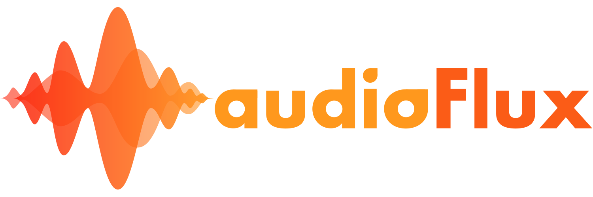
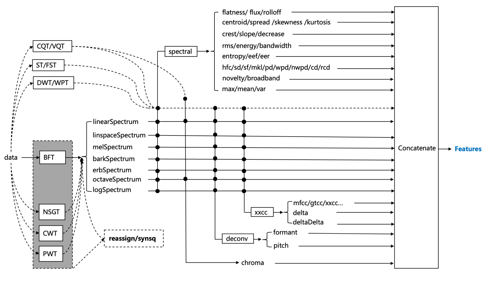

 


# audioFlux

<!--<p align="center">
 
</p>-->


<!-- 
[](https://pypi.org/project/aubio/)
[](https://anaconda.org/conda-forge/aubio)
[](http://aubio.readthedocs.io/en/latest/?badge=latest "Latest documentation") -->

<!-- shields.io -->
 


[](https://codebeat.co/projects/github-com-libaudioflux-audioflux-master)


A library for audio and music analysis, feature extraction. 

Can be used for deep learning, pattern recognition, signal processing, bioinformatics, statistics, finance, etc

## Overview 

###  Description 

In audio domain, feature extraction is particularly important for Audio Classification, Speech enhancement, Audio/Music Separation,music-information-retrieval(MIR), ASR and other audio task.

In the above tasks, **mel spectrogram** and **mfcc** features are commonly used in traditional machine-learning based on statistics and deep-learning based on neural network.

**`audioFlux`** provides systematic, comprehensive and multi-dimensional feature extraction and combination, and combines various deep learning network models to conduct research and development learning in different fields.

###  Functionality 

**`audioFlux`** is based on the design of data flow. It decouples each algorithm module structurally, and it is convenient, fast and efficient to extract features from large batches.The following are the main feature architecture diagrams, specific and detailed description view the documentation.  


<!---->

The main functions of **`audioFlux`** include **transform**, **feature** and **mir** modules. 
#### 1. transform
In the time–frequency representation, main transform algorithm: 

- **`BFT`**&nbsp;&nbsp; -  &nbsp;&nbsp;Based Fourier Transform, similar short-time Fourier transform.
- **`NSGT`** - &nbsp; Non-Stationary Gabor Transform.
- **`CWT`**&nbsp;&nbsp; - &nbsp;&nbsp;Continuous Wavelet Transform.
- **`PWT`**&nbsp;&nbsp; - &nbsp;&nbsp;Pseudo Wavelet Transform.

<!-- &emsp -->

The above transform supports all the following frequency scale types:  

- Linear -  Short-time Fourier transform spectrogram.
- Linspace - Linspace-scale spectrogram.
- Mel - Mel-scale spectrogram.
- Bark - Bark-scale spectrogram.
- Erb - Erb-scale spectrogram.
- Octave - Octave-scale spectrogram.
- Log - Logarithmic-scale spectrogram.

The following transform are not supports multiple frequency scale types, only used as independent transform: 

- **`CQT`** -  &nbsp;&nbsp;Constant-Q Transform.
- **`VQT`** -  &nbsp;&nbsp;Variable-Q Transform. 
- **`ST`**&nbsp;&nbsp; - &nbsp;&nbsp;S-Transform/Stockwell Transform.
- **`FST`** - &nbsp;&nbsp;Fast S-Transform.
- **`DWT`** - &nbsp;&nbsp;Discrete Wavelet Transform.
- **`WPT`** - &nbsp;&nbsp;Wave Packet Transform.
- **`SWT`** - &nbsp;&nbsp;Stationary Wavelet Transform. 

Detailed transform function, description, and use view the documentation.

The *_synchrosqueezing_* or *_reassignment_* is a technique for sharpening a time-frequency representation, contains the following algorithms:

- `reassign` - reassign transform for `STFT`.
- `synsq` - reassign data use `STFT` data. 
- `wsst` - reassign transform for `CWT`.

#### 2. feature
The feature module contains the following algorithms:

- `spectral ` - Spectrum feature, supports all spectrum types.
- `xxcc` -  Cepstrum coefficients, supports all spectrum types.
- `deconv` - Deconvolution for spectrum, supports all spectrum types.
- `chroma` - Chroma feature, only supports `CQT` spectrum, Linear/Octave spectrum based on `BFT`. 

<!-- harmonic pitch class profiles(HPCP) -->

#### 3. mir 
The mir module contains the following algorithms:

- `pitch` - YIN, STFT, etc algorithm.
- `onset` - Spectrum flux, novelty, etc algorithm. 
- `hpss` - Median filtering, NMF algorithm.

## Installation
 

The library is cross-platform and currently supports Linux, macOS, Windows, iOS and Android systems. 

### Python Package Intsall  

Using PyPI: 

```
$ pip install audioflux 
```

Using Anaconda: 

```
$ conda install -c conda-forge audioflux
```

Building from source:

```
$ python setup.py build
$ python setup.py install
```

<!--Read installation instructions:
https://audioflux.top/install-->

### iOS build
To compile iOS on a Mac, Xcode Command Line Tools must exist in the system:  

- Install the full Xcode package
- install Xcode Command Line Tools when triggered by a command or run xcode-select command: 

```
$ xcode-select --install 
```
Enter the **`audioFlux`** project **`scripts`** directory and switch to the current directory, run the following script to build and compile:

```
$ ./build_iOS.sh
```

Build  and compile successfully, the project build compilation results are in the **`build`** folder

### Android build
The current system development environment needs to be installed [**android NDK**](https://developer.android.com/ndk), ndk version>=16,after installation, set the environment variable ndk path.  
 
For example, ndk installation path is `~/Android/android-ndk-r16b`:  

```
$ export NDK_ROOT=~/Android/android-ndk-r16b
$ export PATH=$NDK_ROOT:$PATH
```

Android **`audioFlux`** build uses [**fftw**](https://www.fftw.org/) library to accelerate performance, compile the single-floating point version for android platform. fftw lib successful compilation, copy to  **`audioFlux`** project **`scripts/android/fftw3`** directory.

Enter the **`audioFlux`** project **`scripts`** directory and switch to the current directory, run the following script to build and compile:

```
$ ./build_android.sh
```

Build  and compile successfully, the project build compilation results are in the **`build`** folder

## Documentation

Documentation of the package can be found online:

[https://audioflux.top](https://audioflux.top/)

## Contributing
We are more than happy to collaborate and receive your contributions to **`audioFlux`**. If you want to contribute, the best way is is to submit your code. <a href="https://github.com/libAudioFlux/audioFlux/pulls">Create a pull request</a>

You are also more than welcome to suggest any improvements, including proposals for need help, find a bug, have a feature request, ask a general question, new algorithms. <a href="https://github.com/libAudioFlux/audioFlux/issues/new">Open an issue</a>

<!-- ## Citing -->

## License
audioFlux project is available MIT License.