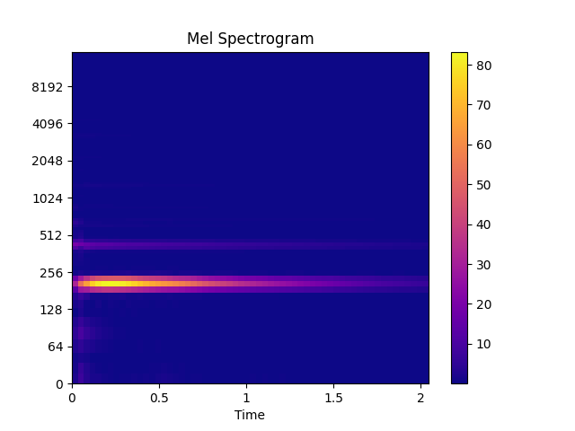
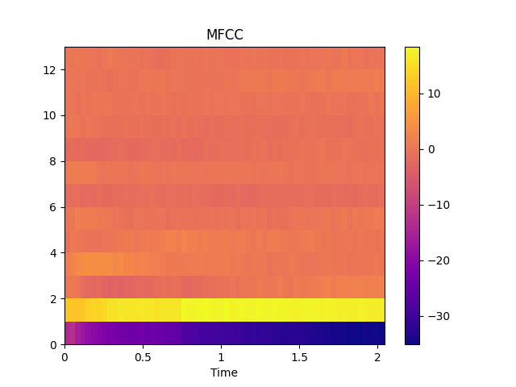

 


# audioFlux

<!--<p align="center">
 
</p>-->


<!-- 
[](https://pypi.org/project/aubio/)
[](https://anaconda.org/conda-forge/aubio)
[](http://aubio.readthedocs.io/en/latest/?badge=latest "Latest documentation") -->
<!---->

<!-- shields.io -->
 


[](https://pypi.org/project/audioflux/)
[](https://pypi.org/project/audioflux/)
[](https://pypi.org/project/audioflux/)

[](https://audioflux.top/index.html)
[](https://doi.org/10.5281/zenodo.7548288)

<!--[](https://codebeat.co/projects/github-com-libaudioflux-audioflux-master)
-->


A library for audio and music analysis, feature extraction. 


#  Table of Contents

- [Overview](#overview)
  - [Description](#description)
  - [Functionality](#functionality)
    - [Transform](#1-transform)
    - [Feature](#2-feature)
    - [MIR](#3-mir)
- [Quickstart](#quickstart)
	-  [Mel & MFCC](#mel--mfcc)
	-  [CWT & Synchrosqueezing](#cwt--synchrosqueezing)
	-  [Other examples](#other-examples)
- [Installation](#installation)
    - [Python Package Intsall](#python-package-intsall)
    - [Building for mobile](#Building-for-mobile)
    - [Building from source](#building-from-source)
- [Benchmark](#benchmark)
    - [Server performance](#server-performance)
    - [Mobile performance](#mobile-performance)
- [Documentation](#documentation)
- [Contributing](#contributing)
- [Citing](#citing)
- [License](#license)


## Overview 

###  Description 

In audio domain, feature extraction is particularly important for Audio Classification, Speech enhancement, Audio/Music Separation,music-information-retrieval(MIR), ASR and other audio task.

In the above tasks, **mel spectrogram** and **mfcc** features are commonly used in traditional machine-learning based on statistics and deep-learning based on neural network.

**`audioFlux`** provides systematic, comprehensive and multi-dimensional feature extraction and combination, and combines various deep learning network models to conduct research and development learning in different fields.

Can be used for deep learning, pattern recognition, signal processing, bioinformatics, statistics, finance, etc.

###  Functionality 

**`audioFlux`** is based on the design of data flow. It decouples each algorithm module structurally, and it is convenient, fast and efficient to extract features from large batches.The following are the main feature architecture diagrams, specific and detailed description view the documentation.  


<!---->

The main functions of **`audioFlux`** include **transform**, **feature** and **mir** modules. 
#### 1. Transform
In the time–frequency representation, main transform algorithm: 

- **`BFT`**&nbsp;&nbsp; -  &nbsp;&nbsp;Based Fourier Transform, similar short-time Fourier transform.
- **`NSGT`** - &nbsp; Non-Stationary Gabor Transform.
- **`CWT`**&nbsp;&nbsp; - &nbsp;&nbsp;Continuous Wavelet Transform.
- **`PWT`**&nbsp;&nbsp; - &nbsp;&nbsp;Pseudo Wavelet Transform.

<!-- &emsp -->

The above transform supports all the following frequency scale types:  

- Linear -  Short-time Fourier transform spectrogram.
- Linspace - Linspace-scale spectrogram.
- Mel - Mel-scale spectrogram.
- Bark - Bark-scale spectrogram.
- Erb - Erb-scale spectrogram.
- Octave - Octave-scale spectrogram.
- Log - Logarithmic-scale spectrogram.

The following transform are not supports multiple frequency scale types, only used as independent transform: 

- **`CQT`** -  &nbsp;&nbsp;Constant-Q Transform.
- **`VQT`** -  &nbsp;&nbsp;Variable-Q Transform. 
- **`ST`**&nbsp;&nbsp; - &nbsp;&nbsp;S-Transform/Stockwell Transform.
- **`FST`** - &nbsp;&nbsp;Fast S-Transform.
- **`DWT`** - &nbsp;&nbsp;Discrete Wavelet Transform.
- **`WPT`** - &nbsp;&nbsp;Wave Packet Transform.
- **`SWT`** - &nbsp;&nbsp;Stationary Wavelet Transform. 

Detailed transform function, description, and use view the documentation.

The *_synchrosqueezing_* or *_reassignment_* is a technique for sharpening a time-frequency representation, contains the following algorithms:

- **`reassign`** - reassign transform for `STFT`.
- **`synsq`** - reassign data use `CWT` data. 
- **`wsst`** - reassign transform for `CWT`.

#### 2. Feature
The feature module contains the following algorithms:

- **`spectral`** - Spectrum feature, supports all spectrum types.
- **`xxcc`** -  Cepstrum coefficients, supports all spectrum types.
- **`deconv`** - Deconvolution for spectrum, supports all spectrum types.
- **`chroma`** - Chroma feature, only supports `CQT` spectrum, Linear/Octave spectrum based on `BFT`. 

<!-- harmonic pitch class profiles(HPCP) -->

#### 3. MIR 
The mir module contains the following algorithms:

- **`pitch`** - YIN, STFT, etc algorithm.
- **`onset`** - Spectrum flux, novelty, etc algorithm. 
- **`hpss`** - Median filtering, NMF algorithm.


## Quickstart
To install the **`audioFlux`** package, Python >=3.6, using the released python package:

 ```bash
 pip install audioflux
 ```
 
 ### Mel & MFCC

Mel spectrogram and Mel-frequency cepstral coefficients 

```python
import numpy as np
import audioflux as af

import matplotlib.pyplot as plt
from audioflux.display import fill_spec

# Get a 220Hz's audio file path
sample_path = af.utils.sample_path('220')

# Read audio data and sample rate
audio_arr, sr = af.read(sample_path)

# Extract mel spectrogram
spec_arr, mel_fre_band_arr = af.mel_spectrogram(audio_arr, num=128, radix2_exp=12, samplate=sr)
spec_arr = np.abs(spec_arr)

# Extract mfcc
mfcc_arr, _ = af.mfcc(audio_arr, cc_num=13, mel_num=128, radix2_exp=12, samplate=sr)

# Display
audio_len = audio_arr.shape[0]
# calculate x/y-coords
x_coords = np.linspace(0, audio_len / sr, spec_arr.shape[1] + 1)
y_coords = np.insert(mel_fre_band_arr, 0, 0)
fig, ax = plt.subplots()
img = fill_spec(spec_arr, axes=ax,
                x_coords=x_coords, y_coords=y_coords,
                x_axis='time', y_axis='log',
                title='Mel Spectrogram')
fig.colorbar(img, ax=ax)

fig, ax = plt.subplots()
img = fill_spec(mfcc_arr, axes=ax,
                x_coords=x_coords, x_axis='time',
                title='MFCC')
fig.colorbar(img, ax=ax)

plt.show()
```



### CWT & Synchrosqueezing

Continuous Wavelet Transform spectrogram and its corresponding synchrosqueezing reassignment spectrogram

```python
import numpy as np
import audioflux as af
from audioflux.type import SpectralFilterBankScaleType, WaveletContinueType
from audioflux.utils import note_to_hz

import matplotlib.pyplot as plt
from audioflux.display import fill_spec

# Get a 220Hz's audio file path
sample_path = af.utils.sample_path('220')

# Read audio data and sample rate
audio_arr, sr = af.read(sample_path)
audio_arr = audio_arr[:4096]

cwt_obj = af.CWT(num=84, radix2_exp=12, samplate=sr, low_fre=note_to_hz('C1'),
                 bin_per_octave=12, wavelet_type=WaveletContinueType.MORSE,
                 scale_type=SpectralFilterBankScaleType.OCTAVE)

cwt_spec_arr = cwt_obj.cwt(audio_arr)

synsq_obj = af.Synsq(num=cwt_obj.num,
                     radix2_exp=cwt_obj.radix2_exp,
                     samplate=cwt_obj.samplate)

synsq_arr = synsq_obj.synsq(cwt_spec_arr,
                            filter_bank_type=cwt_obj.scale_type,
                            fre_arr=cwt_obj.get_fre_band_arr())

# Show CWT
fig, ax = plt.subplots(figsize=(7, 4))
img = fill_spec(np.abs(cwt_spec_arr), axes=ax,
                x_coords=cwt_obj.x_coords(),
                y_coords=cwt_obj.y_coords(),
                x_axis='time', y_axis='log',
                title='CWT')
fig.colorbar(img, ax=ax)
# Show Synsq
fig, ax = plt.subplots(figsize=(7, 4))
img = fill_spec(np.abs(synsq_arr), axes=ax,
                x_coords=cwt_obj.x_coords(),
                y_coords=cwt_obj.y_coords(),
                x_axis='time', y_axis='log',
                title='Synsq')
fig.colorbar(img, ax=ax)

plt.show()
```


### Other examples

- [CQT & Chroma](docs/examples.md#cqt--chroma)
- [Different Wavelet Type](docs/examples.md#different-wavelet-type)
- [Spectral Features](docs/examples.md#spectral-features)
- [Pitch Estimate](docs/examples.md#pitch-estimate)
- [Onset Detection](docs/examples.md#onset-detection)
- [Harmonic Percussive Source Separation](docs/examples.md#harmonic-percussive-source-separation)

More example scripts are provided in the [Documentation](https://audioflux.top/) section.

## Installation
 

The library is cross-platform and currently supports Linux, macOS, Windows, iOS and Android systems.

### Python Package Intsall  

Using PyPI: 

```
$ pip install audioflux 
```

<!--Using Anaconda: 

```
$ conda install -c conda-forge audioflux
```-->


<!--Read installation instructions:
https://audioflux.top/install-->

### Building for mobile

For iOS, Android. Read installation instructions:

* [docs/installing_mobile.md](docs/installing_mobile.md)

### Building from source

For Linux, macOS, Windows systems. Read installation instructions:

* [docs/installing.md](docs/installing.md)

## Benchmark
### Server performance
server hardware:

    - CPU: AMD Ryzen Threadripper 3970X 32-Core Processor
    - Memory: 128GB
    
Each sample data is 128ms(sampling rate: 32000, data length: 4096).

The total time spent on extracting features for 1000 sample data.

| Package    | [audioFlux](https://github.com/libAudioFlux/audioFlux) | [librosa](https://github.com/librosa/librosa) | [pyAudioAnalysis](https://github.com/tyiannak/pyAudioAnalysis) | [python\_speech\_features](https://github.com/jameslyons/python_speech_features) |
| ------ |  ------ |  ------ |  ------ |  ------ | 
| Mel    | 0.777s    | 2.967s  | --              | --                       |
| MFCC   | 0.797s    | 2.963s  | 0.805s          | 2.150s                   |
| CQT    | 5.743s    | 21.477s | --              | --                       |
| Chroma | 0.155s    | 2.174s  | 1.287s          | --                       |
 
### Mobile performance
For 128ms audio data per frame(sampling rate: 32000, data length: 4096).

The time spent on extracting features for 1 frame data.

| Mobile | iPhone 13 Pro | iPhone X | Honor V40 | OPPO Reno4 SE 5G |
| ------ |  ------ |  ------ |  ------ |  ------ | 
| Mel    | 0.249ms       | 0.359ms  | 0.313ms   | 0.891ms          |
| MFCC   | 0.249ms       | 0.361ms  | 0.315ms   | 1.116ms          |
| CQT    | 0.350ms       | 0.609ms  | 0.786ms   | 1.779ms          |
| Chroma | 0.354ms       | 0.615ms  | 0.803ms   | 1.775ms          |

## Documentation

Documentation of the package can be found online:

[https://audioflux.top](https://audioflux.top/)

## Contributing
We are more than happy to collaborate and receive your contributions to **`audioFlux`**. If you want to contribute, please fork the latest git repository and create a feature branch. Submitted requests should pass all continuous integration tests.

You are also more than welcome to suggest any improvements, including proposals for need help, find a bug, have a feature request, ask a general question, new algorithms. <a href="https://github.com/libAudioFlux/audioFlux/issues/new">Open an issue</a>

## Citing

If you want to cite **`audioFlux`** in a scholarly work, there are two ways to do it.

- If you are using the library for your work, for the sake of reproducibility, please cite
  the version you used as indexed at Zenodo:

    [](https://doi.org/10.5281/zenodo.7548288)

## License
audioFlux project is available MIT License.


