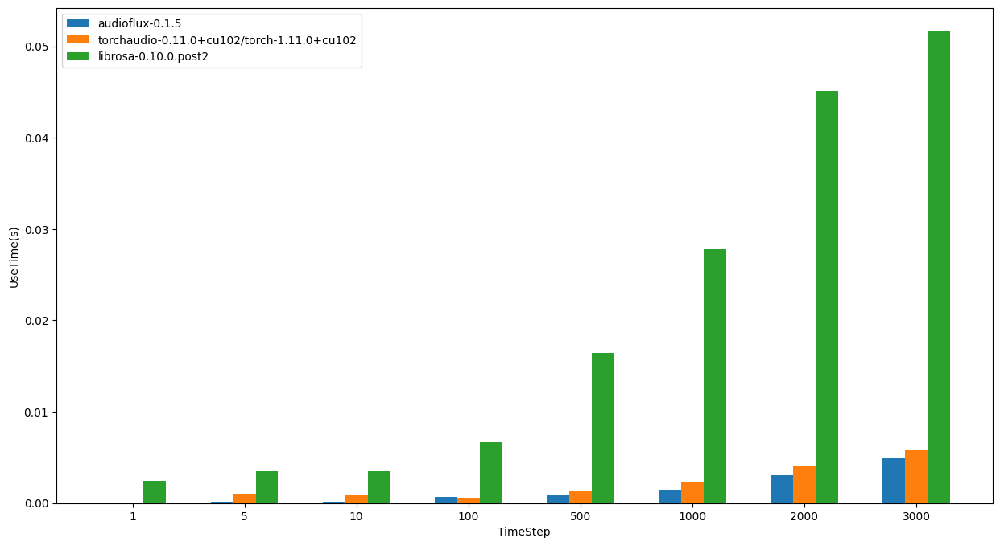
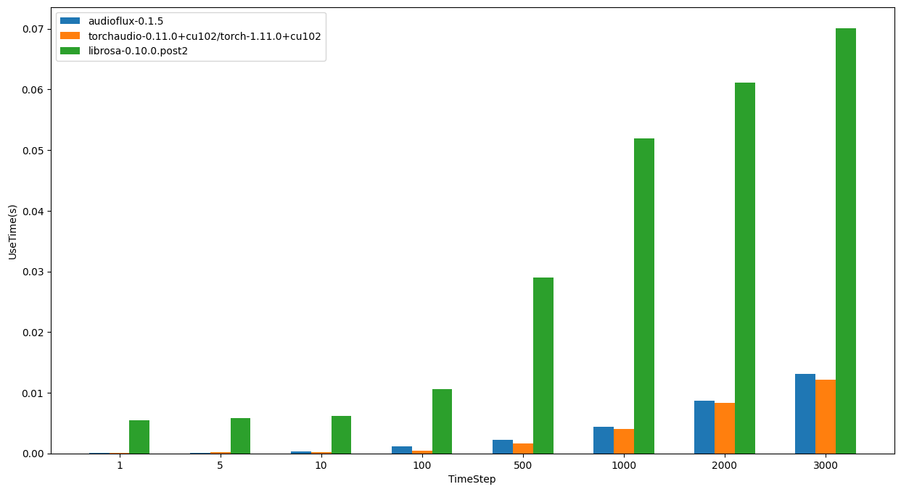
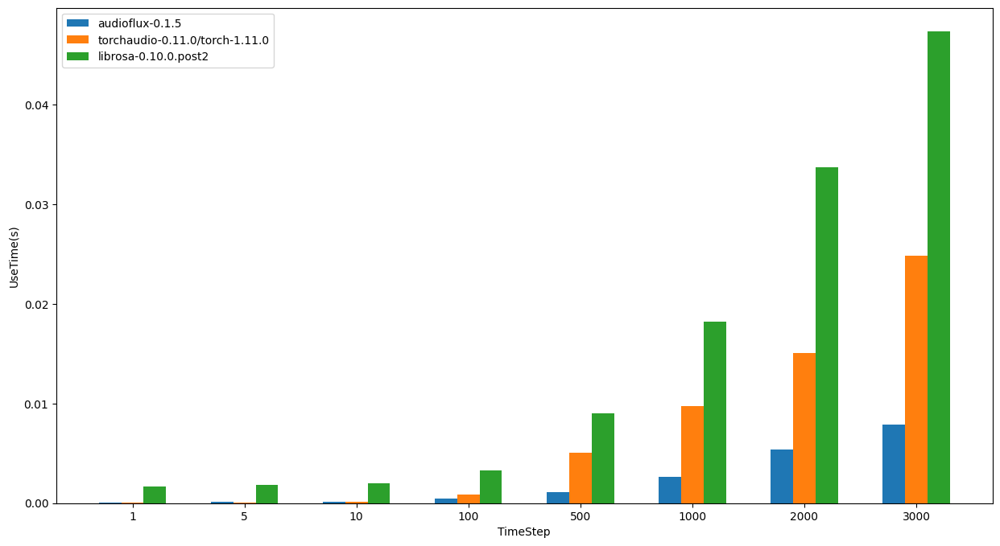
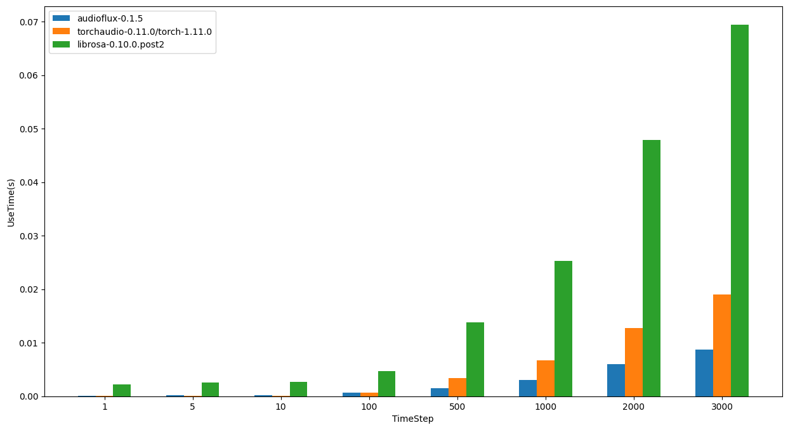

# Benchmark

## Introduce
In the field of deep learning for audio, the mel spectrogram is the most commonly used audio feature. The performance of mel spectrogram features can be benchmarked and compared using audio feature extraction libraries such as the following:

| Library |  Language | Version | About |
| ---- | ---- | ---- |  ---- |   
| [audioFlux](https://github.com/libAudioFlux/audioFlux)  |  C/Python  |  0.1.5  |  A library for audio and music analysis, feature extraction  |  
|  [torchaudio](https://github.com/pytorch/audio)  | Python |  0.11.0  |  Data manipulation and transformation for audio signal processing, powered by PyTorch  | 
|  [librosa](https://github.com/librosa/librosa) |  Python   | 0.10.0  |  Python library for audio and music analysis  | 
|  [essentia](https://github.com/MTG/essentia) |  C++/Python   | 2.0.1  |  C++ library for audio and music analysis, description and synthesis, including Python bindings  | 

- audioFlux: developed in C with a Python wrapper, it has different bridging processes for different platforms, and supports **OpenBLAS**, **MKL**, etc.
- torchaudio: developed in PyTorch, which is optimized for CPUs and uses **MKL** as its backend. This evaluation does not include the GPU version of PyTorch.
- librosa: developed purely in Python, mainly based on **NumPy** and **SciPy**, with NumPy using **OpenBLAS** as its backend.
- essentia: developed in C++ with a Python wrapper, it uses **Eigen** and **FFTW** as its backend.

There are many factors that can affect the performance evaluation results, including CPU architecture, operating system, compilation system, selection of basic linear algebra libraries, and usage of project APIs, all of which can have a certain impact on the evaluation results.

For the most common mel features in the audio field, the major performance bottlenecks are FFT computation, matrix computation, and multi-threaded parallel processing, while minor bottlenecks include algorithmic business implementation and Python packaging.

- Regarding FFT computation, librosa uses SciPy's fftpack for accelerated FFT computation, which is slower than FFTW3, MKL, and Accelerate.    
- Regarding matrix computation, MKL is faster than OpenBLAS, while OpenBLAS is faster than Eigen.    
- Regarding multi-threaded parallel processing, it depends on whether each project has support for it.

## Scripts

If you want to compare and test multiple libraries, you can use:  

```shell
$ python run_benchmark.py -p audioflux,torchaudio,librosa -r 1000 -er 10  -t 1,5,10,100,500,1000,2000,3000
```

* -p:  The library name, list
* -r:  The number of sample data, number
* -er: The number of `run_xxx.py`  calls, number
* -t:  The time of each sample data, list

If you want to test a single library, you can use:    

```shell 
$ python run_audioflux.py -r 1000 -t 1,5,10,100,500,1000,2000,3000
``` 

If you want to see more usage instructions, you can execute `python run_xxx.py --help`

### Notice
In the field of audio, libraries related to audio feature extraction have their own functional characteristics and provide different types of features. This evaluation does not aim to test all the performance comparisons of their feature extraction in detail. However, as the mel spectrum is one of the most important and fundamental features, all of these libraries support it.

There are many factors that can affect the performance evaluation results, such as CPU architecture, operating system, compilation system, choice of basic linear algebra library, and the usage of project APIs, which will have a certain impact on the evaluation results. In order to be as fair as possible and to better reflect actual business needs, the following conditions are based on in this evaluation:

1. macOS/Linux operating system, three types of CPUs: Intel/AMD/M1.
2. The libraries use the latest official release version or the latest official source code compiled with high performance support, and the fastest one is selected.
3. In terms of API usage, the official standards are followed, and "warming up" is used for each corresponding method of the libraries (the first execution time is not counted), and the execution time of the initialization is not counted.
4. In terms of data length, various actual business considerations are taken into account when selecting the test data.   

> When the data is short, the first execution time of most libraries may be relatively slow. To reflect actual business needs and to be fair, this first execution time is not counted. If the library API design provides initialization functions, they will be created and repeatedly called in actual business scenarios, and the initialization execution time is also not counted. 

### Warn
 > ⚠️ When using Python scientific computing related libraries such as Conda, PyTorch, TensorFlow, XGBoost, LightGBM, etc., almost all of them use Intel Math Kernel Library (MKL). MKL uses OpenMP for parallel acceleration, but only one instance of OpenMP can exist in the same process. When these libraries are used together, it is best to link all libraries to the same location of libomp, otherwise an error will occur. Modifying the environment variables according to the prompt may result in slower program execution and unreliable results. Relevant tools can be used to rewrite the libomp linking path of the related libraries.

## Performance

### Base benchmark

Use audioFlux/torchaudio/librosa script, for AMD/Intel/M1 CPUs and Linux/macOS operating system. 

The time required to calculate the mel-spectrogram for 1000 sample data according to a TimeStep of 1/5/10/100/500/1000/2000/3000. Where fft_len=2048, slide_len=512, sampling_rate=32000.   

#### Linux - AMD

	- OS: Ubuntu 20.04.4 LTS
	- CPU: AMD Ryzen Threadripper 3970X 32-Core Processor



| TimeStep | audioflux | torchaudio | librosa   | 
| -------- |  -------- |  --------- |  ------   |
| 1        | 0.04294s  | 0.07707s   | 2.41958s  |
| 5        | 0.14878s  | 1.05589s   | 3.52610s  |
| 10       | 0.18374s  | 0.83975s   | 3.46499s  |
| 100      | 0.67030s  | 0.61876s   | 6.63217s  |
| 500      | 0.94893s  | 1.29189s   | 16.45968s |
| 1000     | 1.43854s  | 2.23126s   | 27.78358s |
| 2000     | 3.08714s  | 4.10869s   | 45.12714s |
| 3000     | 4.90343s  | 5.86299s   | 51.62876s |

#### Linux - Intel

	- OS: Ubuntu 20.04.4 LTS
	- CPU: Intel(R) Core(TM) i7-6850K CPU @ 3.60GHz



| TimeStep | audioflux   | torchaudio | librosa   | 
| -------- |  --------   | ---------- | -------   |
| 1        | 0.08106s    | 0.11043s   | 5.51295s  |
| 5        | 0.11654s    | 0.16005s   | 5.77631s  |
| 10       | 0.29173s    | 0.15352s   | 6.13656s  |
| 100      | 1.18150s    | 0.39958s   | 10.61641s |
| 500      | 2.23883s    | 1.58323s   | 28.99823s |
| 1000     | 4.42723s    | 3.98896s   | 51.97518s |
| 2000     | 8.73121s    | 8.28444s   | 61.13923s |
| 3000     | 13.07378s   | 12.14323s  | 70.06395s |

#### macOS - Intel

	- OS: 12.6.1 (21G217)
	- CPU: 3.8GHz 8‑core 10th-generation Intel Core i7, Turbo Boost up to 5.0GHz



| TimeStep | audioflux | torchaudio | librosa   | 
| -------- |  -------- |  --------- |  ------   |
| 1        | 0.07605s  | 0.06451s   | 1.70139s  |
| 5        | 0.14946s  | 0.08464s   | 1.86964s  |
| 10       | 0.16641s  | 0.10762s   | 2.00865s  |
| 100      | 0.46902s  | 0.83551s   | 3.28890s  |
| 500      | 1.08860s  | 5.05824s   | 8.98265s  |
| 1000     | 2.64029s  | 9.78269s   | 18.24391s |
| 2000     | 5.40025s  | 15.08991s  | 33.68184s |
| 3000     | 7.92596s  | 24.84823s  | 47.35941s |

#### macOS - M1

	- OS: 12.4 (21F79)
	- CPU: Apple M1



| TimeStep | audioflux | torchaudio | librosa   | 
| -------- |  -------- |  --------- |  ------   |
| 1        | 0.06110s  | 0.06874s   | 2.22518s  |
| 5        | 0.23444s  | 0.07922s   | 2.55907s  |
| 10       | 0.20691s  | 0.11090s   | 2.71813s  |
| 100      | 0.68694s  | 0.63625s   | 4.74433s  |
| 500      | 1.47420s  | 3.37597s   | 13.83887s |
| 1000     | 3.00926s  | 6.76275s   | 25.24646s |
| 2000     | 5.99781s  | 12.69573s  | 47.84029s |
| 3000     | 8.76306s  | 19.03391s  | 69.40428s |


### Summarize
In summary, from the performance comparison results of the three libraries, librosa takes the most time, which is also in line with common sense.    
On linux/amd processors, audioflux is slightly faster than torchaudio, but slightly slower on linux/intel.    
On the macOS system, for large-size sample data, audioflux is faster than torchaudio, and intel is more obvious than m1; for small-size sample data, torchaudio is faster than audioflux.   

⚠️ Although the development of benchmark is attempted to be as objective and fair as possible, every benchmarks have their drawbacks, and are limited to particular testing procedures, datasets and platforms. And also, this benchmark does not compare additional features that a library may support, or other APIs,  cross-platform, etc. We encourage users to benchmarks with their own data sets and platforms.  

### Other Test

#### Server Performance

Each sample data is 128ms(sampling rate: 32000, data length: 4096).

The total time spent on extracting features for 1000 sample data.

	- OS: Ubuntu 20.04.4 LTS
	- CPU: AMD Ryzen Threadripper 3970X 32-Core Processor

| Package    | [audioFlux](https://github.com/libAudioFlux/audioFlux) | [librosa](https://github.com/librosa/librosa) | [pyAudioAnalysis](https://github.com/tyiannak/pyAudioAnalysis) | [python\_speech\_features](https://github.com/jameslyons/python_speech_features) |
| ------ |  ------ |  ------ |  ------ |  ------ | 
| Mel    | 0.777s    | 2.967s  | --              | --                       |
| MFCC   | 0.797s    | 2.963s  | 0.805s          | 2.150s                   |
| CQT    | 5.743s    | 21.477s | --              | --                       |
| Chroma | 0.155s    | 2.174s  | 1.287s          | --                       |

#### Mobile Performance

For 128ms audio data per frame(sampling rate: 32000, data length: 4096).

The time spent on extracting features for 1 frame data.

| Mobile | iPhone 13 Pro | iPhone X | Honor V40 | OPPO Reno4 SE 5G |
| ------ |  ------ |  ------ |  ------ |  ------ | 
| Mel    | 0.249ms       | 0.359ms  | 0.313ms   | 0.891ms          |
| MFCC   | 0.249ms       | 0.361ms  | 0.315ms   | 1.116ms          |
| CQT    | 0.350ms       | 0.609ms  | 0.786ms   | 1.779ms          |
| Chroma | 0.354ms       | 0.615ms  | 0.803ms   | 1.775ms          |


