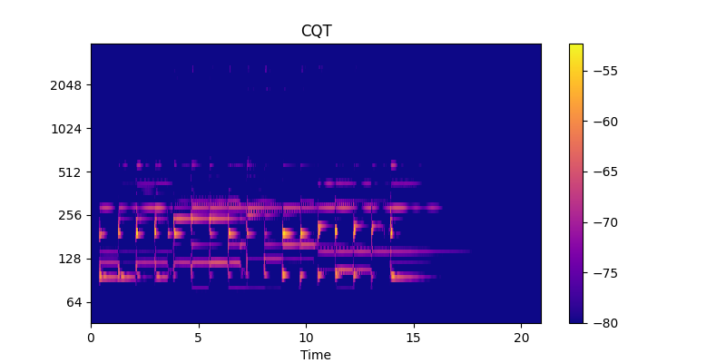
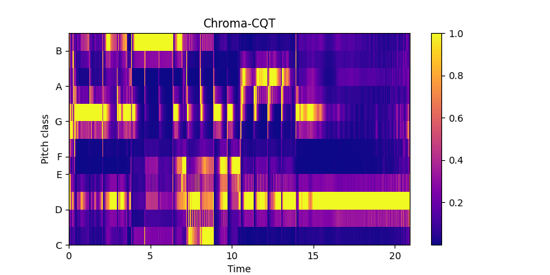
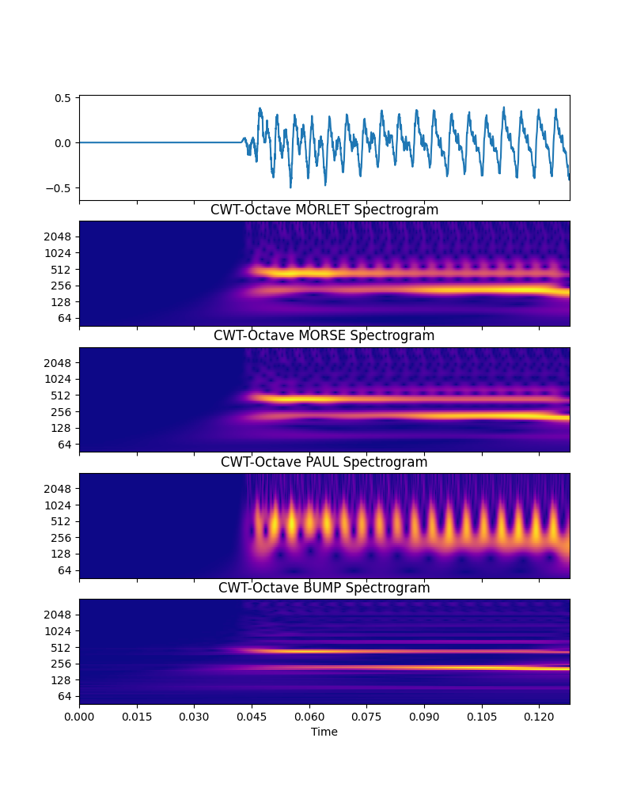
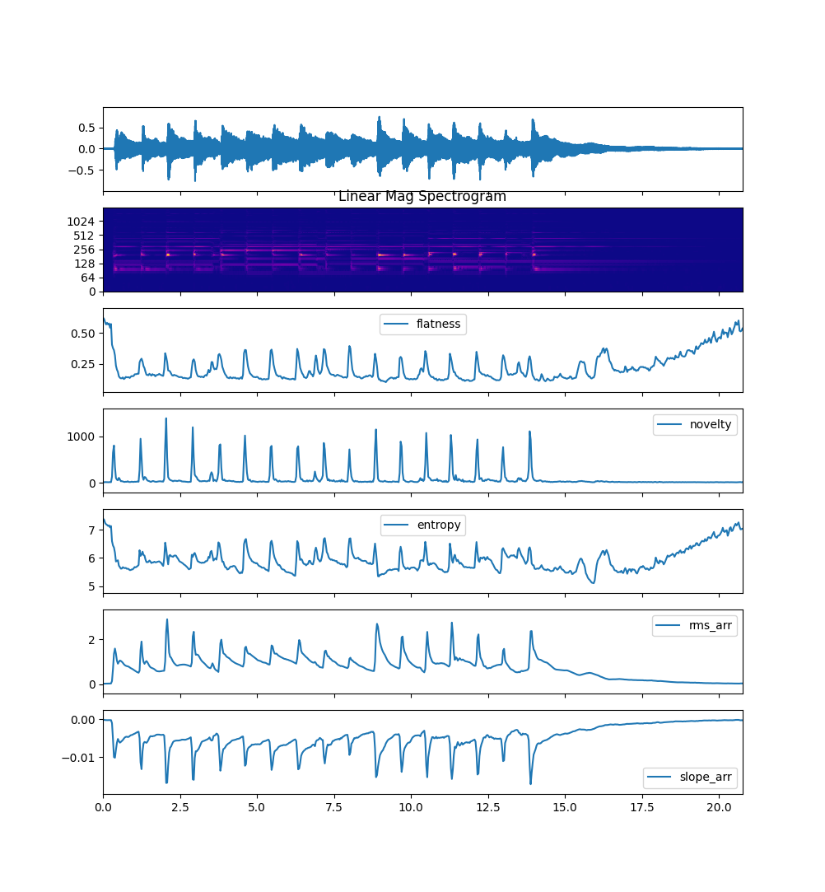
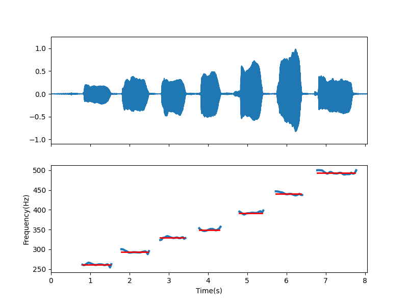
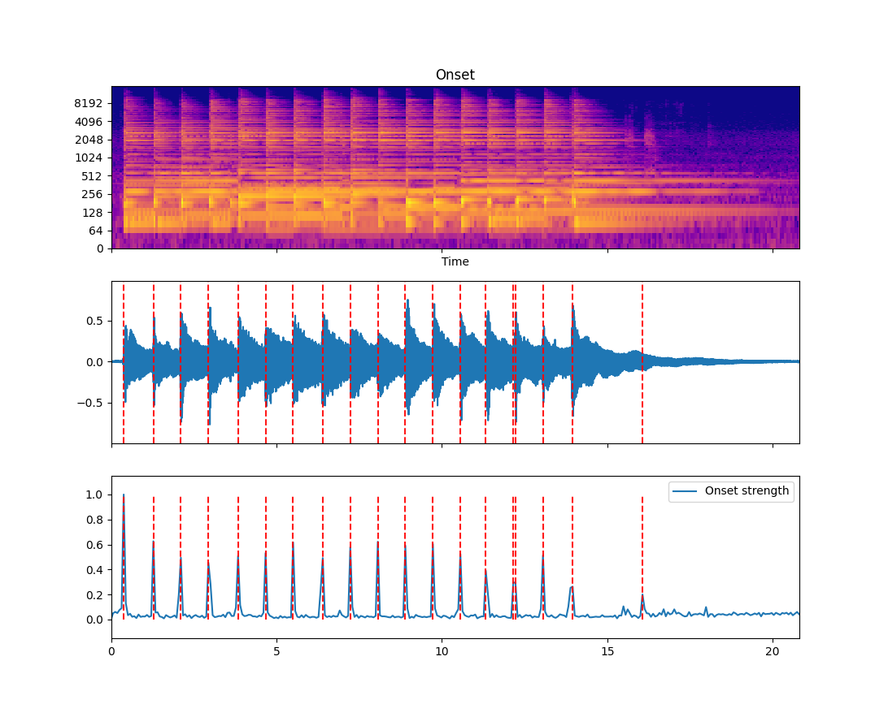
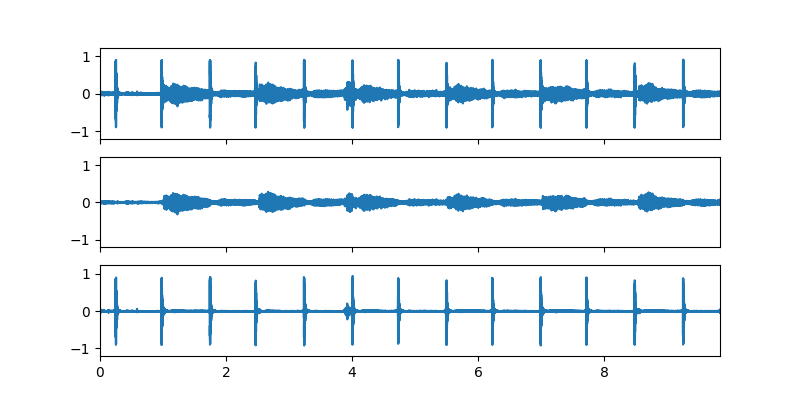
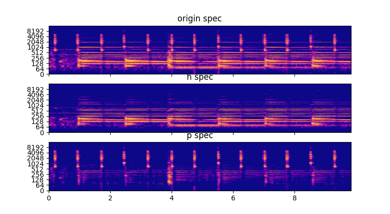

# Examples


- [CQT & Chroma](#cqt--chroma)
- [Wavelet Type](#wavelet-type)
- [Spectral Features](#spectral-features)
- [Pitch Estimate](#pitch-estimate)
- [Onset Detection](#onset-detection)
- [Harmonic-percussive source separation](#harmonic-percussive-source-separation)


## CQT & Chroma

Constant-Q Transform spectrogram and cqt_chroma 

```python
import numpy as np
import audioflux as af

# Get a 220Hz's audio file path
sample_path = af.utils.sample_path('demo_guitar2')

# Read audio data and sample rate
audio_arr, sr = af.read(sample_path)

# Create CQT object
cqt_obj = af.CQT(num=84, samplate=sr)

# Extract CQT and Chroma_cqt
cqt_arr = cqt_obj.cqt(audio_arr)
chroma_cqt_arr = cqt_obj.chroma(cqt_arr)

# Display
import matplotlib.pyplot as plt
from audioflux.display import fill_spec
audio_len = audio_arr.shape[0]

# Display CQT
fig, ax = plt.subplots()
img = fill_spec(np.abs(cqt_arr), axes=ax,
                x_coords=cqt_obj.x_coords(audio_len), x_axis='time',
                y_coords=cqt_obj.y_coords(), y_axis='log',
                title='CQT')
fig.colorbar(img, ax=ax)

# Display Chroma_cqt
fig, ax = plt.subplots()
img = fill_spec(chroma_cqt_arr, axes=ax,
                x_coords=cqt_obj.x_coords(audio_len),
                x_axis='time', y_axis='chroma',
                title='Chroma-CQT')
fig.colorbar(img, ax=ax)

# Show plot
plt.show()
```





## Wavelet Type

Comparison of different Wavelet Continue Type spectrogram

```python
import audioflux as af
import numpy as np
from audioflux.type import SpectralFilterBankScaleType, WaveletContinueType
from audioflux.utils import note_to_hz
import matplotlib.pyplot as plt
from audioflux.display import fill_spec
from audioflux.display import fill_wave

audio_path = af.utils.sample_path('220')
audio_arr, sr = af.read(audio_path)
# CWT can only input fft_length data
# For radix2_exp=12, then fft_length=4096
audio_arr = audio_arr[:4096]

# Create CWT object of Octave and Extract spectrogram
obj = af.CWT(num=84, radix2_exp=12, samplate=sr,
              low_fre=note_to_hz('C1'), bin_per_octave=12,
              wavelet_type=WaveletContinueType.MORLET,
              scale_type=SpectralFilterBankScaleType.OCTAVE)
morlet_spec_arr = obj.cwt(audio_arr)
morlet_spec_arr = np.abs(morlet_spec_arr)

obj = af.CWT(num=84, radix2_exp=12, samplate=sr,
              low_fre=note_to_hz('C1'), bin_per_octave=12,
              wavelet_type=WaveletContinueType.MORSE,
              scale_type=SpectralFilterBankScaleType.OCTAVE)
morse_spec_arr = obj.cwt(audio_arr)
morse_spec_arr = np.abs(morse_spec_arr)

obj = af.CWT(num=84, radix2_exp=12, samplate=sr,
              low_fre=note_to_hz('C1'), bin_per_octave=12,
              wavelet_type=WaveletContinueType.PAUL,
              scale_type=SpectralFilterBankScaleType.OCTAVE)
paul_spec_arr = obj.cwt(audio_arr)
paul_spec_arr = np.abs(paul_spec_arr)

obj = af.CWT(num=84, radix2_exp=12, samplate=sr,
              low_fre=note_to_hz('C1'), bin_per_octave=12,
              wavelet_type=WaveletContinueType.BUMP,
              scale_type=SpectralFilterBankScaleType.OCTAVE)
bump_spec_arr = obj.cwt(audio_arr)
bump_spec_arr = np.abs(bump_spec_arr)


# Show spectrogram plot
fig, ax = plt.subplots(nrows=5, figsize=(8, 10), sharex=True)
fill_wave(audio_arr, samplate=sr, axes=ax[0])

fill_spec(morlet_spec_arr, axes=ax[1],
                x_coords=obj.x_coords(),
                y_coords=obj.y_coords(),
                y_axis='log',
                title='CWT-Octave MORLET Spectrogram')

fill_spec(morse_spec_arr, axes=ax[2],
                x_coords=obj.x_coords(),
                y_coords=obj.y_coords(),
                y_axis='log',
                title='CWT-Octave MORSE Spectrogram')

fill_spec(paul_spec_arr, axes=ax[3],
                x_coords=obj.x_coords(),
                y_coords=obj.y_coords(),
                y_axis='log',
                title='CWT-Octave PAUL Spectrogram')

fill_spec(bump_spec_arr, axes=ax[4],
                x_coords=obj.x_coords(),
                y_coords=obj.y_coords(),
                x_axis='time', y_axis='log',
                title='CWT-Octave BUMP Spectrogram')
plt.show()
```




## Spectral Features

Flatness, Novelty, Entropy, RMS and Slope features

```python
import numpy as np
import matplotlib.pyplot as plt
import audioflux as af
from audioflux.display import fill_wave, fill_plot, fill_spec
from audioflux.type import SpectralDataType, SpectralFilterBankScaleType

# Get a 220Hz's audio file path
sample_path = af.utils.sample_path('demo_guitar')

# Read audio data and sample rate
audio_arr, sr = af.read(sample_path)

bft_obj = af.BFT(num=256, samplate=sr, radix2_exp=12, slide_length=1024,
               data_type=SpectralDataType.MAG,
               scale_type=SpectralFilterBankScaleType.LINEAR)
spec_arr = bft_obj.bft(audio_arr)
spec_arr = np.abs(spec_arr)

# Create Spectral object and extract flatness feature
spectral_obj = af.Spectral(num=bft_obj.num,
                           fre_band_arr=bft_obj.get_fre_band_arr())
n_time = bft_obj.cal_time_length(len(audio_arr))
spectral_obj.set_time_length(n_time)

flatness_arr = spectral_obj.flatness(spec_arr)

novelty_arr = spectral_obj.novelty(spec_arr)

entropy_arr = spectral_obj.entropy(spec_arr)

rms_arr = spectral_obj.rms(spec_arr)

slope_arr = spectral_obj.slope(spec_arr)

times = np.arange(0, len(flatness_arr)) * (bft_obj.slide_length / bft_obj.samplate)

fig, ax = plt.subplots(nrows=7, sharex=True)
fill_wave(audio_arr, samplate=sr, axes=ax[0])

fill_spec(spec_arr, axes=ax[1],
                x_coords=bft_obj.x_coords(len(audio_arr)),
                y_coords=bft_obj.y_coords(),
                y_axis='log',
                title='Linear Mag Spectrogram')

fill_plot(times, flatness_arr, axes=ax[2], label='flatness')

fill_plot(times, novelty_arr, axes=ax[3], label='novelty')

fill_plot(times, entropy_arr, axes=ax[4], label='entropy')

fill_plot(times, rms_arr, axes=ax[5], label='rms_arr')

fill_plot(times, slope_arr, axes=ax[6], label='slope_arr')

plt.show()
```




## Pitch Estimate

Fundamental frequency (F0) estimation using the YIN algorithm.


```python
import numpy as np
import audioflux as af
from audioflux import Pitch
import matplotlib.pyplot as plt
from audioflux.display import fill_wave
from audioflux.type import PitchType

audio_arr, sr = af.read(af.utils.sample_path('demo_voice'))

obj = Pitch(pitch_type=PitchType.YIN)

fre_arr, value_arr1, value_arr2 = obj.pitch(audio_arr)
fre_arr[fre_arr<1] = np.nan

times = np.arange(0, len(fre_arr)) * (obj.slide_length / obj.samplate)

fig, ax = plt.subplots(nrows=2, sharex=True)
fill_wave(audio_arr, samplate=sr, axes=ax[0])
ax[1].plot(times, fre_arr, label='fre', linewidth=3)
plt.show()
```



## Onset Detection

Locate note onset events by picking peaks in an onset strength envelope.


```python
import numpy as np
import audioflux as af
import matplotlib.pyplot as plt
from audioflux.display import fill_wave, fill_plot, fill_spec
from audioflux.type import SpectralFilterBankScaleType, SpectralDataType, NoveltyType

audio_arr, sr = af.read(af.utils.sample_path('demo_guitar'))

bft_obj = af.BFT(num=128, samplate=sr, radix2_exp=11, slide_length=2048,
                 scale_type=SpectralFilterBankScaleType.MEL,
                 data_type=SpectralDataType.POWER)
spec_arr = bft_obj.bft(audio_arr)
spec_dB_arr = af.utils.power_to_db(np.abs(spec_arr))

n_fre, n_time = spec_dB_arr.shape
onset_obj = af.Onset(time_length=n_time, fre_length=n_fre,
                     slide_length=bft_obj.slide_length, samplate=bft_obj.samplate,
                     novelty_type=NoveltyType.FLUX)
point_arr, evn_arr, time_arr, value_arr = onset_obj.onset(spec_dB_arr)


audio_len = audio_arr.shape[0]
fig, axes = plt.subplots(nrows=3, sharex=True)
img = fill_spec(spec_dB_arr, axes=axes[0],
                x_coords=bft_obj.x_coords(audio_len),
                y_coords=bft_obj.y_coords(),
                x_axis='time', y_axis='log',
                title='Onset')

ax = fill_wave(audio_arr, samplate=sr, axes=axes[1])
ax.vlines(time_arr, -1, 1, color='r', alpha=0.9,
           linestyle='--', label='Onsets')

times = np.arange(0, len(evn_arr)) * (bft_obj.slide_length / sr)
ax = fill_plot(times, evn_arr, axes=axes[2], label='Onset strength')
ax.vlines(time_arr, evn_arr.min(), evn_arr.max(), color='r', alpha=0.9,
          linestyle='--', label='Onsets')

plt.show()
```




### Harmonic-percussive source separation

Decompose audio into harmonic and percussive components


```python
import numpy as np
import audioflux as af
import matplotlib.pyplot as plt
from audioflux.display import fill_wave, fill_spec
from audioflux.type import SpectralDataType, WindowType, SpectralFilterBankScaleType

audio_arr, sr = af.read(af.utils.sample_path('demo_guitar3'))

radix2_exp = 11
slide_length = (1 << radix2_exp) // 4
hpss_obj = af.HPSS(radix2_exp=radix2_exp, window_type=WindowType.HAMM,
                   slide_length=slide_length, h_order=21, p_order=31)
h_arr, p_arr = hpss_obj.hpss(audio_arr)

bft_obj = af.BFT(num=2049, radix2_exp=12, samplate=sr,
                 data_type=SpectralDataType.POWER,
                 scale_type=SpectralFilterBankScaleType.LINEAR)

audio_arr = audio_arr[:len(h_arr)]

origin_spec_arr = bft_obj.bft(audio_arr, result_type=1)
h_spec_arr = bft_obj.bft(h_arr, result_type=1)
p_spec_arr = bft_obj.bft(p_arr, result_type=1)

origin_spec_arr = af.utils.power_to_abs_db(origin_spec_arr)
h_spec_arr = af.utils.power_to_abs_db(h_spec_arr)
p_spec_arr = af.utils.power_to_abs_db(p_spec_arr)

audio_len = audio_arr.shape[0]

fig, axes = plt.subplots(nrows=3, sharex=True, sharey=True)
fill_wave(audio_arr, samplate=sr, axes=axes[0])
fill_wave(h_arr, samplate=sr, axes=axes[1])
fill_wave(p_arr, samplate=sr, axes=axes[2])

fig, axes = plt.subplots(nrows=3, sharex=True, sharey=True)
fill_spec(origin_spec_arr, axes=axes[0],
                x_coords=bft_obj.x_coords(audio_len),
                y_coords=bft_obj.y_coords(),
                y_axis='log',
                title='origin spec')
fill_spec(h_spec_arr, axes=axes[1],
                x_coords=bft_obj.x_coords(audio_len),
                y_coords=bft_obj.y_coords(),
                y_axis='log',
                title='h spec')
fill_spec(p_spec_arr, axes=axes[2],
                x_coords=bft_obj.x_coords(audio_len),
                y_coords=bft_obj.y_coords(),
                y_axis='log',
                title='p spec')

plt.show()
```


