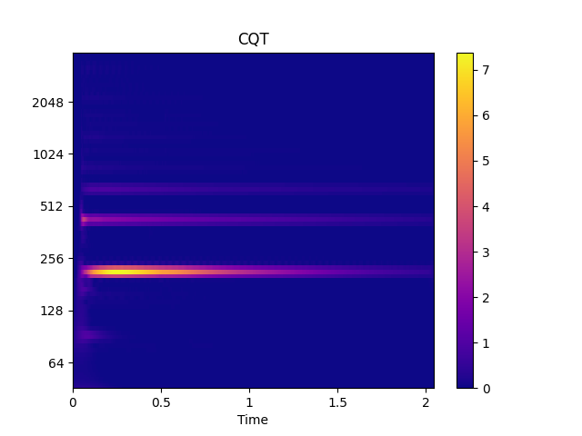
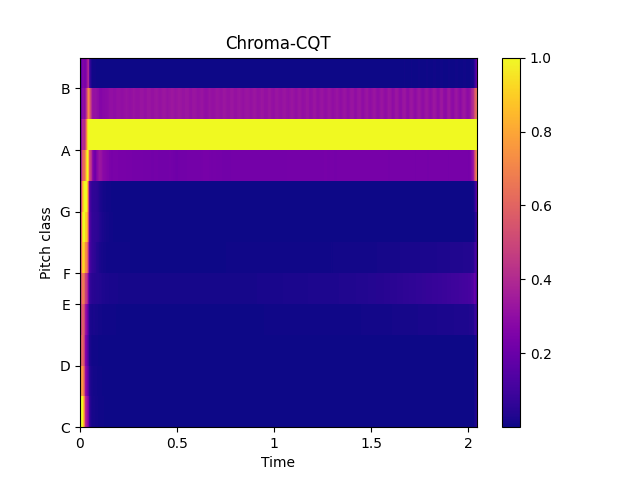

Extract cqt/chroma_cqt
----------------------

Simple extraction of cqt and chroma_cqt

.. code-block:: python
    :linenos:

    import numpy as np
    import audioflux as af

    # Get a 220Hz's audio file path
    sample_path = af.utils.sample_path('220')

    # Read audio data and sample rate
    audio_arr, sr = af.read(sample_path)

    # Extract CQT
    cqt_arr, _ = af.cqt(audio_arr, samplate=sr)

    # Extract CQT_CHROMA
    chroma_cqt_arr = af.chroma_cqt(audio_arr, samplate=sr)

We recommend using the :ref:`CQT <transforms/cqt:CQT>` class, you can use it more flexibly and efficiently.

.. code-block:: python
    :linenos:

    import numpy as np
    import audioflux as af

    # Get a 220Hz's audio file path
    sample_path = af.utils.sample_path('220')

    # Read audio data and sample rate
    audio_arr, sr = af.read(sample_path)

    # Create CQT object
    cqt_obj = af.CQT(num=84, samplate=sr)

    # Extract CQT and Chroma_cqt
    cqt_arr = cqt_obj.cqt(audio_arr)
    chroma_cqt_arr = cqt_obj.chroma(cqt_arr)

    # Display
    import matplotlib.pyplot as plt
    from audioflux.display import fill_spec
    audio_len = audio_arr.shape[-1]

    # Display CQT
    fig, ax = plt.subplots()
    img = fill_spec(np.abs(cqt_arr), axes=ax,
                    x_coords=cqt_obj.x_coords(audio_len), x_axis='time',
                    y_coords=cqt_obj.y_coords(), y_axis='log',
                    title='CQT')
    fig.colorbar(img, ax=ax)

    # Display Chroma_cqt
    fig, ax = plt.subplots()
    img = fill_spec(chroma_cqt_arr, axes=ax,
                    x_coords=cqt_obj.x_coords(audio_len),
                    x_axis='time', y_axis='chroma',
                    title='Chroma-CQT')
    fig.colorbar(img, ax=ax)

