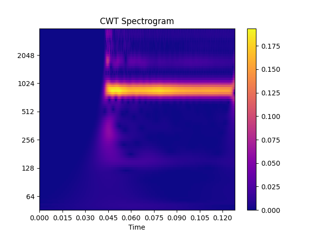

Extract cwt
-----------

.. code-block:: python
    :linenos:

    import numpy as np
    import audioflux as af
    from audioflux.type import SpectralFilterBankScaleType, WaveletContinueType

    # Get a 880Hz's audio file path
    sample_path = af.utils.sample_path('880')

    # Read audio data and sample rate
    audio_arr, sr = af.read(sample_path)

    # Create CWT object and extract cwt
    cwt_obj = af.CWT(num=84, radix2_exp=12, samplate=sr,
                     wavelet_type=WaveletContinueType.MORSE,
                     scale_type=SpectralFilterBankScaleType.OCTAVE)

    # The cwt() method can only extract data of fft_length=2**radix2_exp=4096
    cwt_arr = cwt_obj.cwt(audio_arr[:4096])
    cwt_arr = np.abs(cwt_arr)

    # Display spectrogram
    import matplotlib.pyplot as plt
    from audioflux.display import fill_spec
    audio_len = audio_arr.shape[0]
    fig, ax = plt.subplots()
    img = fill_spec(cwt_arr, axes=ax,
              x_coords=cwt_obj.x_coords(),
              y_coords=cwt_obj.y_coords(),
              x_axis='time', y_axis='log',
              title='CWT Spectrogram')
    fig.colorbar(img, ax=ax)

In addition to :ref:`CWT <transforms/cwt:CWT - Continuous Wavelet Transform>`, you can also try
:ref:`BFT <transforms/bft:BFT - Based Fourier Transform, similar short-time Fourier transform>`/
:ref:`NSGT <transforms/nsgt:NSGT - Non-Stationary Gabor Transform>`/
:ref:`PWT <transforms/pwt:PWT - Pseudo Wavelet Transform>`, etc.
