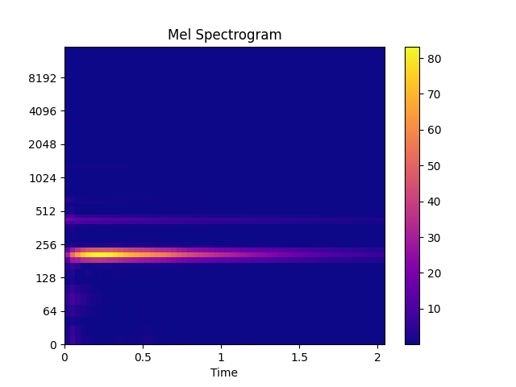

Extract mel spectrogram
-----------------------

Simple extraction of mel spectrogram

.. code-block:: python
    :linenos:

    # Feature extraction example
    import numpy as np
    import audixflux as af

    # Get a 220Hz's audio file path
    sample_path = af.utils.sample_path('220')

    # Read audio data and sample rate
    audio_arr, sr = af.read(sample_path)

    # Extract mel spectrogram
    spec_arr = af.mel_spectrogram(audio_arr, samplate=sr)
    spec_arr = np.abs(spec_arr)

If you want to extract the mel spectrogram multiple times or need
more parameters, it is recommended to use the
:ref:`BFT <transforms/bft:BFT - Based Fourier Transform, similar short-time Fourier transform>` class.

.. code-block:: python
    :linenos:

    import numpy as np
    import audioflux as af
    from audioflux.type import SpectralFilterBankScaleType

    # Get a 220Hz's audio file path
    sample_path = af.utils.sample_path('220')

    # Read audio data and sample rate
    audio_arr, sr = af.read(sample_path)

    # Create BFT object and extract mel spectrogram
    bft_obj = af.BFT(num=128, radix2_exp=12, samplate=sr,
                     scale_type=SpectralFilterBankScaleType.MEL)
    spec_arr = bft_obj.bft(audio_arr)
    spec_arr = np.abs(spec_arr)

    # Display spectrogram
    import matplotlib.pyplot as plt
    from audioflux.display import fill_spec
    audio_len = audio_arr.shape[0]
    fig, ax = plt.subplots()
    img = fill_spec(spec_arr, axes=ax,
              x_coords=bft_obj.x_coords(audio_len),
              y_coords=bft_obj.y_coords(),
              x_axis='time', y_axis='log',
              title='Mel Spectrogram')
    fig.colorbar(img, ax=ax)

Of course, **BFT** can not only extract the Mel spectrogram, but also extract
the following spectrogram (just adjust the `scale_type` parameter):

* Linear(STFT) - Short-time Fourier transform.
* Linspace - Numbers evenly distributed over the specified interval.
* Mel - Mel-scale spectrogram.
* Bark - Bark-scale spectrogram.
* Erb - Erb-scale spectrogram.
* Octave - Octave-scale spectrogram.
* Log - Evenly distributed numbers on a logarithmic scale.