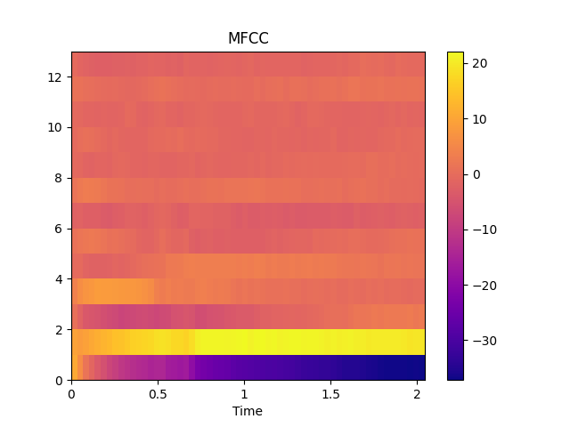

Extract mfcc
------------

Simple extraction of mfcc

.. code-block:: python
    :linenos:

    import numpy as np
    import audioflux as af

    # Get a 220Hz's audio file path
    sample_path = af.utils.sample_path('220')

    # Read audio data and sample rate
    audio_arr, sr = af.read(sample_path)

    # Extract mfcc
    mfcc_arr, _ = af.mfcc(audio_arr, samplate=sr)

We recommend using the
:ref:`BFT <transforms/bft:BFT - Based Fourier Transform, similar short-time Fourier transform>` and
:ref:`XXCC <feature/xxcc:XXCC>` class, you can use it more flexibly and efficiently.

.. code-block:: python
    :linenos:

    import numpy as np
    import audioflux as af
    from audioflux.type import SpectralFilterBankScaleType, SpectralDataType

    # Get a 220Hz's audio file path
    sample_path = af.utils.sample_path('220')

    # Read audio data and sample rate
    audio_arr, sr = af.read(sample_path)

    # Create BFT object and extract mel spectrogram
    bft_obj = af.BFT(num=128, radix2_exp=12, samplate=sr,
                     scale_type=SpectralFilterBankScaleType.MEL,
                     data_type=SpectralDataType.POWER)
    spec_arr = bft_obj.bft(audio_arr)
    spec_arr = np.abs(spec_arr)

    # Create XXCC object and extract mfcc
    xxcc_obj = af.XXCC(bft_obj.num)
    xxcc_obj.set_time_length(time_length=spec_arr.shape[-1])
    mfcc_arr = xxcc_obj.xxcc(spec_arr)

    # Display MFCC
    import matplotlib.pyplot as plt
    from audioflux.display import fill_spec
    audio_len = audio_arr.shape[-1]
    fig, ax = plt.subplots()
    img = fill_spec(mfcc_arr, axes=ax,
              x_coords=bft_obj.x_coords(audio_len), x_axis='time',
              title='MFCC')
    fig.colorbar(img, ax=ax)

Similar to mfcc, you can obtain various cepstral coefficients by adjusting the parameters of
:ref:`BFT <transforms/bft:BFT - Based Fourier Transform, similar short-time Fourier transform>` and
:ref:`XXCC <feature/xxcc:XXCC>`, such as bfcc/gtcc, etc.
